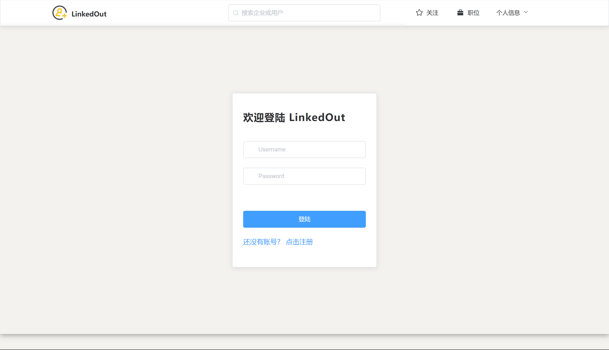
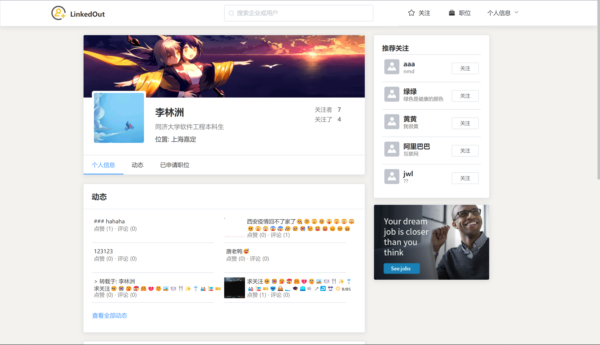
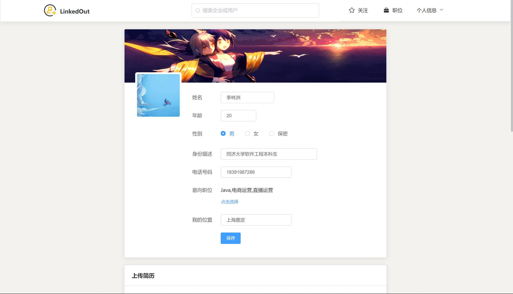
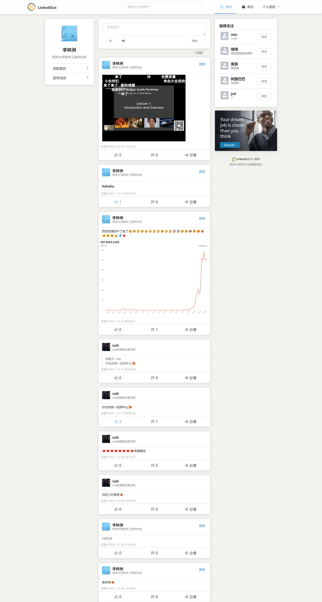
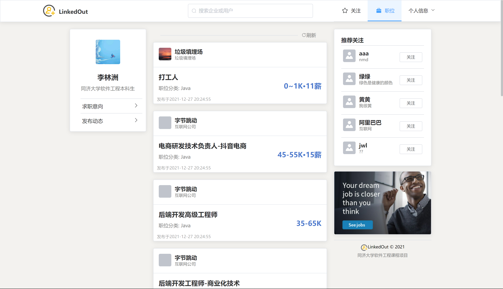
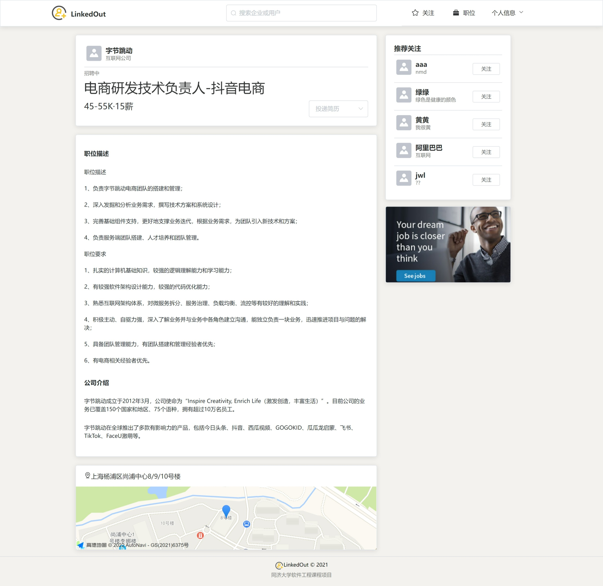

# Linked Out  职业发展社交平台

## 项目简介

同济大学软件工程软件工程、SOA与微服务、软件管理与经济、软件测试等课程项目（2021-2022）

项目架构：Vue + Spring Boot

项目访问：[Link](http://121.5.68.218:8089/)

本仓库仅包括前端代码部分，后端代码详见[ww67652/SOA](https://github.com/ww67652/SOA)

用例规约，详细构件设计，API文档，部署架构等详见[文档](https://github.com/LinzhouLi/LinkedOut-Frontend/tree/main/doc)

## 项目主要页面展示

### 用户/企业模块

登录



个人主页



修改个人信息



### 动态模块

主页（Markdown，视频，图片，表情）



### 招聘模块

职位推荐



职位详情

职位推荐



## 前端代码结构

```shell
│  App.vue
│  config.js # 配置信息
│  main.js
│
├─apis # 接口相关(对应后端3个微服务)
│      axios.js
│      recruit.js
│      tweet.js
│      users.js
│
├─assets # 资源
│      ADimg.jpg
│      background.png
│      job.json
│      logo.png
│      vditor.css
│
├─components # 组件
│      CompanyInfoCard.vue # 企业信息卡片(用于HomePage)
│      EducationExperience.vue # 教育经历
│      FansDialog.vue # 粉丝列表对话框
│      FollowingDialog.vue # 关注者列表对话框
│      JobIntentionDialog.vue # 求职意向选择对话框
│      PageFooter.vue # 页面底部
│      PostTweet.vue # 动态发表组件
│      RecruitmentBriefInfo.vue # 招聘信息简要展示(用于企业主页)
│      RecruitmentDisp.vue # 招聘信息卡片
│      TopNav.vue # 页面顶部导航栏
│      TweetBriefInfo.vue # 动态信息简要展示(用于企业/用户主页)
│      TweetDisp.vue # 动态卡片
│      UserBriefDisp.vue # 用户信息简要展示
│      UserIcon.vue # 用户头像
│      UserInfoCard.vue # 用户信息卡片(用于HomePage)
│      UserRecommendCard.vue # 用户推荐卡片
│      WorkExperience.vue # 工作经验
│
├─router # 路由
│      index.js
│
├─utils # 工具
│      cookie.js
│      loginPage.js
│      utils.js
│
└─views # 页面
    │  LoginPage.vue # 登录
    │  ModifyCompanyInfo.vue # 修改企业信息
    │  ModifyUserInfo.vue # 修改个人信息
    │  NotFoundPage.vue # 404
    │  PostRecruitmentPage.vue # 发布招聘信息
    │  RecruitmentDetailPage.vue # 查看招聘信息详情
    │  RegisterPage.vue # 注册
    │
    ├─CompanyInfo
    │      CompanyDescription.vue # 企业介绍(子路由)
    │      CompanyHome.vue # 企业主页
    │      CompanyInfoPage.vue # 企业主页(子路由)
    │      CompanyRecruitment.vue # 企业招聘信息(子路由)
    │      CompanyTweet.vue # 企业动态(子路由)
    │
    ├─Home
    │      HomePage.vue # HomePage
    │      Recruitment.vue # 推荐职位(子路由)
    │      Search.vue # 搜索结果(子路由)
    │      Tweet.vue # 推荐动态(子路由)
    │
    └─UserInfo
            UserHome.vue # 用户主页
            UserInfoPage.vue # 用户主页(子路由)
            UserRecruitment.vue # 用户已请求岗位(子路由)
            UserTweet.vue # 用户动态(子路由)
```

